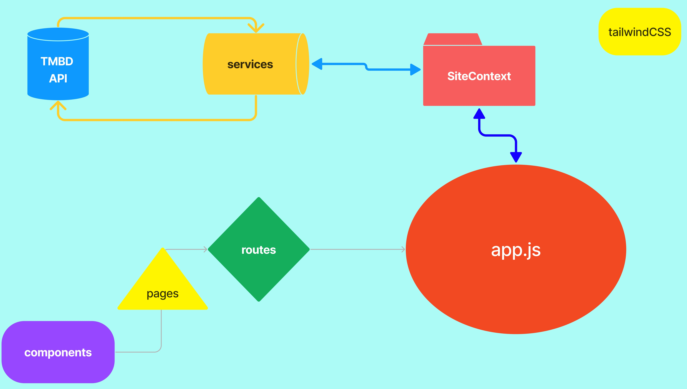
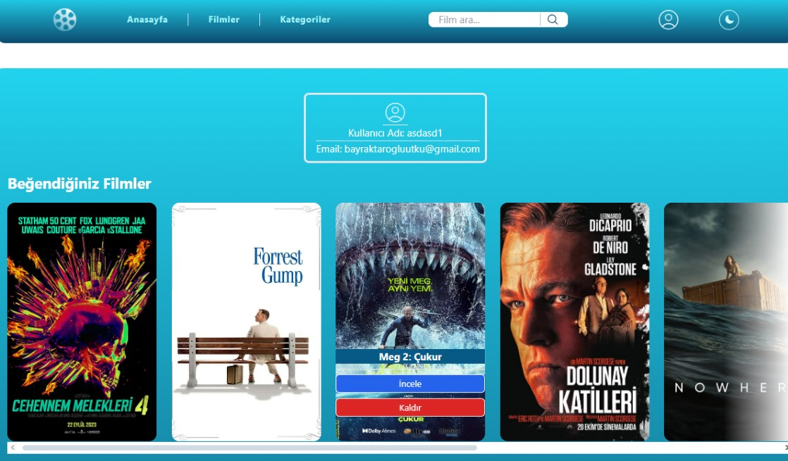
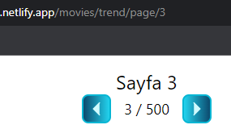
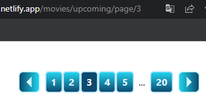
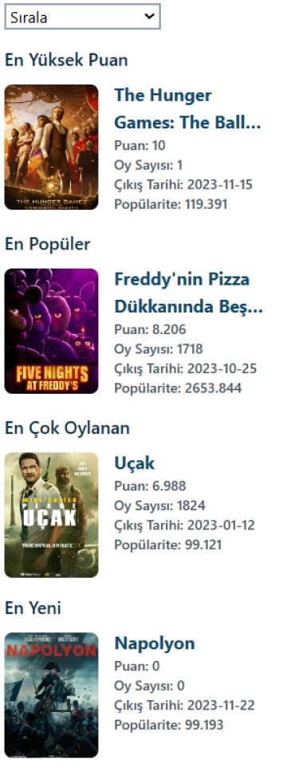

# React Movie App

- ### [Canlı / Live](https://tmdbmovieapp95.netlify.app)

- [TMDB API](https://developer.themoviedb.org/docs)

- [en](#Summary)

- [npm](#npm)

### Özet

Bu proje React, TailwindCss ve CSS kullanarak TMDB API ile geliştirdiğim bir film sitesi projesidir. Projede api istekleri **Axios** kullanılarak, sayfa geçişleri ise **React Router Dom V6** ile gerçekleştirilmiştir.

### Genel Şema ve İşleyiş

Kurgulanan Context yapısı içinde **useLocation hook** aracılığıyla url takip edilir. İlgili pathname render olduğunda **useReducer hook** tarafından MovieServices'te kullanılmış olan "named export" yöntemi sayesinde gerekli api istekleri gerçekleştirilir ve dönen veriler data içinde ilgili alt komponente provide edilir. Alt komponentlerde alınan veriler gerekiyorsa çeşitli filtrelerden geçirilir ve filmler uygun şekilde kullanıcıya gösterilir. Farklı yöntemler denemek amacıyla, belirli koşullar gerçekleştiğinde bazı komponentlerin içinden de axios istekleri yapılmıştır.

  

### Kullanıcı işlemleri

Kullanıcıların bir filmi beğenip kaydedebilmeleri için kayıt olup giriş yapmaları gerekmektedir. Oturum açılmadan **pages>_Profile.js_** sayfasına, oturum açıldıktan sonra **pages>_Authentication.js_** sayfasına ulaşılamaması için bu komponentler **privateRoute** olarak tasarlanmışlardır. Kullanıcı işlemleri ve oturum kontrolleri **LocalStorage** yardımıyla yönetilir. Kullanıcıların beğenip kaydettikleri filmleri profillerinde görüntüleyip daha sonra isterlerse profillerindeki ilgili bölümden kaldırabilmeleri mümkündür.



**components>auth>_Register.js_** komponenti içinde form kontrolleri **Regex** ile sağlanmıştır. Eğer kayıt başarılıysa kullanıcıya **generateUUID** fonksiyonu yardımıyla benzersiz bir id tanımlanır. Projenin sonraki aşamalarına devam edilirse bu id üzerinden kullanıcıların yönetimi gerçekleştirilebilir.

### Sayfa Akışları

- <ins>**pages>movies>_Populer.js_**</ins> komponentinde scroll konumu takip edilerek sayfa sonuna gelindiğinde bir sonraki sayfadaki verilerin getirilmesi için API isteği yapılır ancak bu yöntem Reel DOM'u şişirdiği için verimli değildir.

- <ins>**pages>_Categories.js_**</ins> komponentinde sayfa akışı **virtua** paketi kullanıllarak gerçekleştirilir. Bu sebeple scroll aşağıya doğru kaydrıldığında Reel DOM içinde her zaman aynı sayıda element render edilir, bu yöntem sayfa akışı için daha verimlidir.

### utils

-<ins>**utils>_generatePage.js_**</ins> bileşeni **pages>movies>_Trend.js_** ve **pages>movies>_UpCmoing.js_** sayfalarındaki pagination' lar kullanıldığında route>routes.js dosyasında kurgulanan sayfa yapısına göre yeni sayfaların yüklenmesi için URL değişimini gerçekleştirir. **context>SiteContext.js** içerisinde location takip edilir ve pathname üzerinde değişiklik gerçekleştiğinde belirtilen koşula göre yeni sayfaların yüklenmesi için API istekleri gerçekleştirilir.

<div >


</div>
<br>

<ins>**utils>_navigateDetail.js_**</ins> bileşeni herhangi bir filme tıklandığında o filmin id ve title değerlerine göre **pages>_MovieDetail.js_** sayfası oluşturur ve yine **context>_SiteContext.js_** aracılığıyla pathname değişikliği algılanıp sayfanın içeriğinin yüklenebilmesi için API istekleri gerçekleştirilir.

### context

- #### AuthContext.js

Kullanıcı oturum durumu bu context üzerinde izlenir. activeUser bulunuyorsa alt komponentlere user=true değeri döner ve UI değişiklikleri yapılır.

- #### BestMoviesContext.js

En "..." filmlerin gösterilebilmesi için
**components>movies>rigthPanel>_BestMovies.js_** ile diğer komponentlerin (Populer.js, TopRated.js, Trend.js, upComing.js, Categories.js) iletişimini sağlar.



- #### SelectContext.js

Sıralama işlemlerinin yapılabilmesi için
**components>movies>rigthPanel>_SortingTool.js_** ile diğer componentlerin (Populer.js, TopRated.js, Trend.js, upComing.js, Categories.js) iletişimini sağlar.

- #### SiteContext.js

Film verilerini alt komponentlere dağıtmak için oluşturulmuştur.

### DarkMode

[tailwind Dark Mode](https://tailwindcss.com/docs/dark-mode#toggling-dark-mode-manually)

### Palet

| color | [tailwindColor](https://tailwindcss.com/docs/background-color) |
| ----- | -------------------------------------------------------------- |
| cyan  | 100-950                                                        |
| sky   | 100-950                                                        |
| slate | 100-950                                                        |
| black | #                                                              |
| white | #                                                              |

#### Ek Bilgi

- Projede Eslint uyarıları görülebilir.
- Categories.js koponentindeni bir hata App.css içerisinde manipüle edilmiştir.
- Bazı komponentler css "zoom" attribute ile responsive uyumlu hale getirilmiştir.
- components>movieDetail>right-panel>LineChart.js komponenti temsilidir.
- Kod blokları içerisinde açıklayıcı yorum satırlarına yer verilmiştir.

<hr>

### Summary

This project is a movie website project that I developed with TMDB API using React, TailwindCss and CSS. In the project, api requests were made using **Axios** and page transitions were realized with **React Router Dom V6**.

### General Schema and Functionality

The url is tracked through **useLocation hook** in the constructed Context structure. When the relevant pathname is rendered, the necessary api requests are made by **useReducer hook** through the "named export" method used in MovieServices and the returned data is provided to the relevant sub-component in the data. The data received in the subcomponents is passed through various filters if necessary and the movies are displayed to the user accordingly. In order to try different methods, axios requests were also made from within some components when certain conditions were met.

  

### User operations

In order for users to like and save a movie, they need to register and log in. These components are designed as **privateRoute** so that **pages>_Profile.js_** cannot be accessed without logging in and **pages>_Authentication.js_** cannot be accessed after logging in. User actions and session controls are managed with the help of **LocalStorage**. It is possible for users to view the movies they like and save in their profile and then remove them from the relevant section of their profile if they wish.


In **components>auth>_Register.js_** component, form controls are provided with **Regex**. If the registration is successful, a unique id is defined to the user with the help of the **generateUUID** function. If you continue to the next stages of the project, users can be managed through this id.

### Page Flows

- In the <ins>**pages>movies>_Populer.js_**</ins> component, the scroll position is tracked and an API request is made to fetch the data from the next page when the end of the page is reached, but this method is not efficient because it bloats the Real DOM.

- In the <ins>**pages>_Categories.js_**</ins> component, the page flow is implemented using the **virtua** package. For this reason, scrolling down the scroll always renders the same number of elements in the Real DOM, which is more efficient for page flow.

### utils

<ins>**utils>_generatePage.js_**</ins> component performs URL change to load new pages according to the page structure set up in route>routes.js file when pagination in **pages>movies>_Trend.js_** and **pages>movies>_UpCmoing.js_** pages are used. In **context>SiteContext.js**, location is tracked and API requests are made to load new pages according to the specified condition when the pathname changes.

<div>


</div>  
 <br> 
 
<ins>**utils>_navigateDetail.js_**</ins> component creates a **pages>_MovieDetail.js_** page based on the id and title values of a movie when a movie is clicked, and again through **context>_SiteContext.js_**, the pathname change is detected and API requests are made to load the content of the page.

### context

- #### AuthContext.js

User session status is monitored on this context. If activeUser is present, user=true value is returned to subcomponents and UI changes are made.

- #### BestMoviesContext.js

To show the most "..." movies
Communicates **components>movies>rigthPanel>_BestMovies.js_** with other components (Popular.js, TopRated.js, Trend.js, upComing.js, Categories.js).


- #### SelectContext.js

For sorting operations to be performed
It provides communication between **components>movies>rigthPanel>_SortingTool.js_** and other components (Populer.js, TopRated.js, Trend.js, upComing.js, Categories.js).

- #### SiteContext.js

Created to distribute movie data to subcomponents.

### DarkMode

[tailwind Dark Mode](https://tailwindcss.com/docs/dark-mode#toggling-dark-mode-manually)

### Palette

| color | [tailwindColor](https://tailwindcss.com/docs/background-color) |
| ----- | -------------------------------------------------------------- |
| cyan  | 100-950                                                        |
| sky   | 100-950                                                        |
| slate | 100-950                                                        |
| black | #                                                              |
| white | #                                                              |

#### Additional Information

- Eslint warnings can be seen in the project.
- An error in Categories.js coponent has been manipulated in App.css.
- Some components have been made responsive compatible with the css "zoom" attribute.
- components>movieDetail>right-panel>LineChart.js component is representative.
- Explanatory comment lines were included in the code blocks.

<hr>

### npm

- [react-router-dom](https://www.npmjs.com/package/react-router-dom)

  ```
  npm i react-router-dom@6
  ```

- [axios](https://www.npmjs.com/package/axios)

  ```
  npm install axios
  ```

- [react-player](https://www.npmjs.com/package/react-player)

  ```
  npm install react-player
  ```

- [react-responsive-carousel](https://www.npmjs.com/package/react-responsive-carousel)

  ```
  npm install react-responsive-carousel
  ```

- [swiper](https://www.npmjs.com/package/swiper)

  ```
  npm install swiper
  ```

- [react-chartjs-2](https://www.npmjs.com/package/react-chartjs-2)

  ```
  npm install react-chartjs-2`
  ```

- [chart.js](https://www.npmjs.com/package/chart.js)

  ```
  npm install chart.js
  ```

- [react-responsive](https://www.npmjs.com/package/react-responsive)

  ```
  npm install react-responsive`
  ```

- [react-helmet](https://www.npmjs.com/package/react-helmet)

  ```
  npm install react-helmet
  ```

- [three](https://www.npmjs.com/package/three)

  ```
  npm install three
  ```

- [@react-three/fiber](https://www.npmjs.com/package/@react-three/fiber)

  ```
  npm install @react-three/fiber
  ```

- [@react-three/drei](https://www.npmjs.com/package/@react-three/drei)

  ```
  npm install @react-three/drei
  ```

- [virtua](https://www.npmjs.com/package/virtua)

  ```
  npm install virtua
  ```

- [masonry](https://www.npmjs.com/package/react-responsive-masonry)

  ```
  npm install react-responsive-masonry
  ```

- [tailwindcss](https://tailwindcss.com/docs/guides/create-react-app)
  ```
  npx create-react-app
  ```
